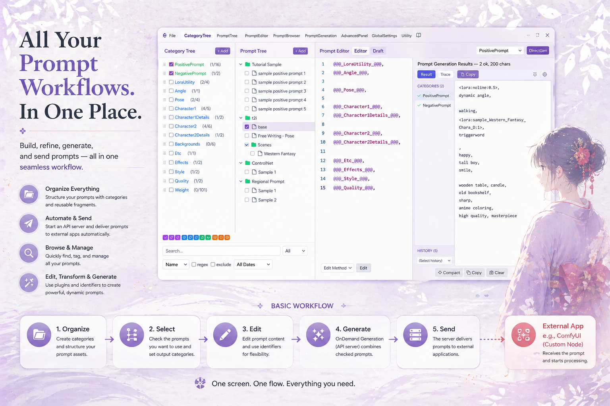
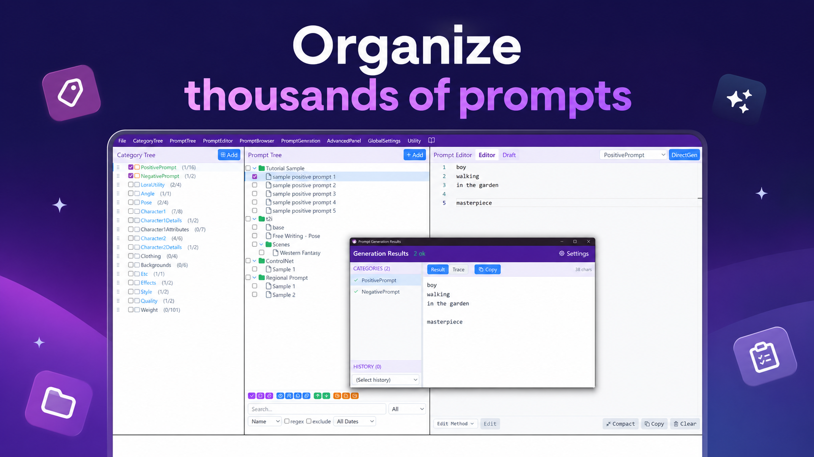
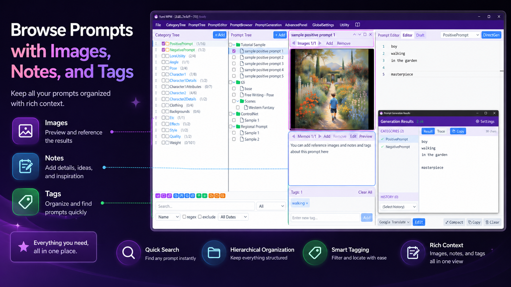
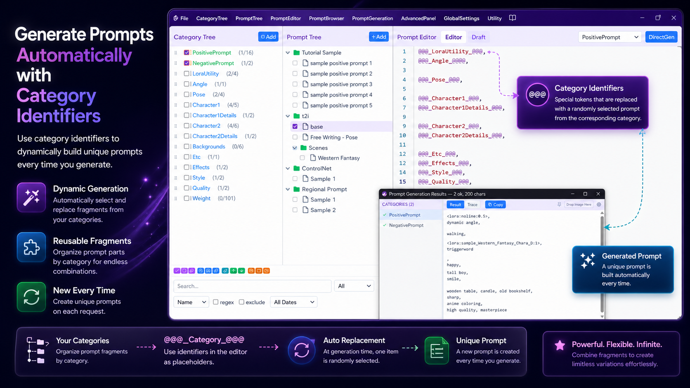
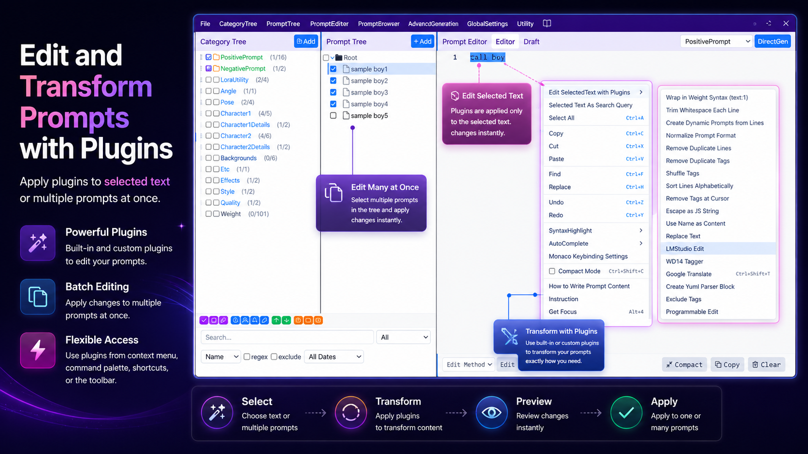

  

<h1 align="center">Yumil MPM</h1>

  A powerful desktop app for creating, organizing, and managing AI prompts.

  <a href="#features">Features</a> &bull;
  <a href="#download">Download</a> &bull;
  <a href="#extensions">Extensions</a> &bull;
  <a href="#support">Support</a> &bull;
  <a href="PRIVACY_POLICY.md">Privacy Policy</a> &bull;
  <a href="README_ja.md">日本語</a>

---

  

---

## Feature Tour

  &nbsp;
  

  &nbsp;
  

  

---

## Features

| Feature | Description |
|---|---|
| **Tree Management** | Organize prompts in a folder/file-style hierarchy. |
| **Category Classification** | Create purpose-based categories such as "Quality", "Character", "Background", and more. |
| **Check Selection** | Select the prompts you want to use with simple checkboxes. |
| **Dynamic String Replacement** | Cross-reference categories and build dynamic prompts with Category Identifiers and Programmable Blocks. |
| **Database Building** | Import from filesystem, clipboard, and more with a variety of Add plugins. |
| **Editing Tools** | Edit plugins to support efficient prompt editing workflows. |
| **External App Integration** | Send prompts on-demand to ComfyUI, Stable Diffusion, and other apps via the built-in API server. |
| **Queue Management** | Queue multiple prompt generation tasks and process them in sequence. |
| **AI Integration** | Control Yumil MPM from AI assistants like Claude Code via the MCP protocol. |

---

## Download

| Platform | Link |
|---|---|
| **Windows** | [Microsoft Store](https://apps.microsoft.com/detail/9P6ML4V166GB) |

### System Requirements

| | Requirement |
|---|---|
| **OS** | Windows 10/11 |
| **Architecture** | x64 |

### Linux / macOS

Experimental, unsupported builds are available on [GitHub Releases](https://github.com/maigonia/YumilMPM/releases/latest). These builds compile successfully but have not been tested or signed by the author, and fall outside the official support provided for the Microsoft Store version.

- **Linux**: `.deb` (Debian/Ubuntu) and `.AppImage` (generic), x86_64
- **macOS**: `.dmg`, Apple Silicon only (M1/M2/M3/M4)

---

## Extensions

Integrate Yumil MPM into your image generation workflow.

| Extension | Description |
|---|---|
| **[ComfyUI Extension](https://github.com/maigonia/comfyui-yumil-mpm)** | ExternalPromptRequester node and MPM Image Parser node for seamless ComfyUI integration. |
| **[Stable Diffusion WebUI Extension](https://github.com/maigonia/sd-webui-yumil-mpm)** | Send and receive prompts directly from the Stable Diffusion WebUI interface. |

---

## Third-Party Licenses

Yumil MPM uses open-source third-party components. License information is available in the app's About dialog and in [THIRD_PARTY_LICENSES.txt](THIRD_PARTY_LICENSES.txt).

---

## Support

Yumil MPM is developed and maintained with your support.

Support channels are coming soon. Details will be announced once support channels are ready.

---

## Links

- [License (EULA)](LICENSE)
- [Third-Party Licenses](THIRD_PARTY_LICENSES.txt)
- [Privacy Policy](PRIVACY_POLICY.md)
- [Contact](mailto:yumil.mpm@gmail.com)

---

&copy; 2026 maigonia. All rights reserved.

